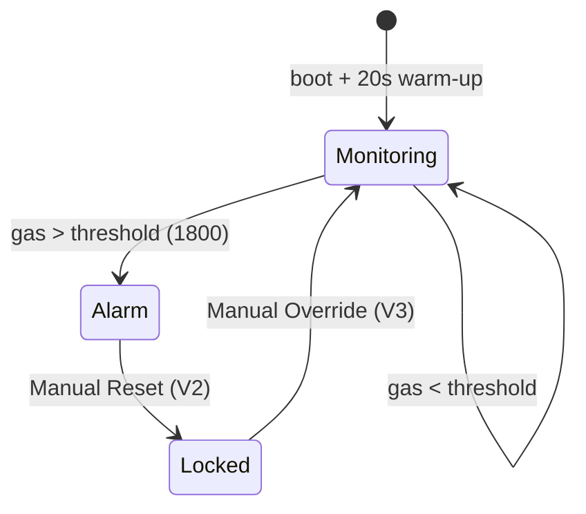

<div align="center">

# 🛡️ G.U.A.R.D
### Gas Unit for Air Risk Detection

**IoT-Based Automated Gas Leak Detection, Alert & Emergency Ventilation System**

*Detects. Decides. Actuates. Reports. Without waiting for a human.*


</div>

---

## 🚨 What is G.U.A.R.D?

> **G.U.A.R.D** stands watch so nobody has to.

G.U.A.R.D is an ESP32-powered safety system that continuously sniffs the air for combustible/toxic gas using an **MQ-2 sensor**, and the moment things cross a dangerous threshold, it doesn't just beep — it **acts**:

- 🔴 Flips on a visual alarm
- 🔊 Sounds a non-blocking double-beep buzzer pattern
- 🚪 Swings open a **servo-driven emergency ventilation door**
- ☁️ Pushes everything live to a **Blynk dashboard** — gauge, alarm state, and rate-limited push alerts

All while you watch it happen from your phone, anywhere in the world.

```
   SENSE  →  DECIDE  →  ACTUATE  →  REPORT
   MQ-2      ESP32       LED/Buzzer/    Blynk
   (gas)     (logic)     Servo Door     Dashboard
                              ↑
                    remote commands feed back in
```

---

## ✨ Key Features

| | Feature | Detail |
|---|---|---|
| 🌬️ | **Continuous Monitoring** | MQ-2 sampled every **500 ms** via ESP32 ADC |
| 🚨 | **Multi-Channel Alarm** | Red/Green LEDs + buzzer double-beep + auto-opening door |
| 🚪 | **Emergency Ventilation** | SG90 servo swings the door open (0° → 90°) automatically |
| ☁️ | **Live Cloud Dashboard** | Real-time gauge, alarm LED & remote controls via Blynk |
| 🔁 | **Two-Tier Manual Control** | **Reset** (silence, stay locked) vs **Override** (full re-arm) |
| 🔕 | **Alert Fatigue Prevention** | Push notifications rate-limited to one per 60 seconds |
| 🔥 | **Fail-Safe by Design** | Alarm never silently re-arms itself once cleared |

---

## 🧠 Why the Two-Tier Reset Matters

This is the detail that makes G.U.A.R.D more than a beeping box.



A single tap of **Manual Reset** silences the buzzer and closes the door — but deliberately **locks out** further automatic alarms. Why? Because a quiet room isn't the same as a safe room. If gas is still leaking, the system shouldn't quietly go back to sleep. Only a full **Manual Override** clears the lock and resumes live monitoring.

---

## 🔧 Hardware

<div align="center">

| Component | Role | Pin / Interface |
|---|---|---|
| 🧠 **ESP32 (WROOM-32)** | Brain — sensing, logic, WiFi + Blynk sync | — |
| 🌫️ **MQ-2 Gas Sensor** | Detects combustible/toxic gas | `GPIO 34` (ADC1) |
| ⚙️ **SG90 Micro Servo** | Emergency ventilation door | `GPIO 18` (PWM) |
| 🔊 **Active Buzzer** | Audible double-beep alarm | `GPIO 19` |
| 🔴 **Red LED** | Alarm indicator | `GPIO 21` |
| 🟢 **Green LED** | Safe-state indicator | `GPIO 22` |
| ☁️ **Blynk IoT** | Cloud dashboard + remote control | WiFi 2.4 GHz |

</div>

**Prototype:** breadboard-assembled, all peripherals sharing a common power rail.

---

## 📟 Firmware Logic Snapshot

```cpp
#define WARMUP_TIME     20000   // ms — MQ-2 heater stabilization
#define READ_INTERVAL   500     // ms — sensor polling rate
#define GAS_THRESHOLD   1800    // 12-bit ADC (0–4095 scale)
#define NOTIFY_COOLDOWN 60000   // ms — push alert rate limit
```

**On boot →** withhold all alarm logic for 20s while the MQ-2 heater warms up.
**Every 500ms →** read gas level, push to Blynk gauge (`V0`).
**Threshold crossed →** LED + buzzer + door open + rate-limited `Blynk.logEvent`.

---

## 🖥️ Blynk Dashboard

| Widget | Pin | Behaviour |
|---|:---:|---|
| 📊 Gas Level (Gauge) | `V0` | Live MQ-2 reading, 0–4095, refreshed every 500ms |
| 🔴 Alarm Status (LED) | `V1` | Fills when gas exceeds threshold |
| 🔁 Manual Reset (Switch) | `V2` | Silence + close door, **stays locked** |
| ♻️ Manual Override (Switch) | `V3` | Full reset, resumes auto-monitoring, self-resets |

<div align="center">

| 🟢 Safe State | 🔴 Alarm State |
|:---:|:---:|
| Gas below threshold, controls idle | Gas above threshold, Reset engaged |

</div>

---

## 🧪 Testing & Validation

- ✅ No false triggers during the 20s MQ-2 warm-up window
- ✅ Full alarm chain (LED + buzzer + door + dashboard + push) fires correctly above threshold
- ✅ Repeat notifications suppressed within the 60s cooldown during a sustained leak
- ✅ Manual Reset silences & closes, correctly withholds re-trigger
- ✅ Manual Override fully resets state and resumes monitoring
- ✅ Dashboard mirrors real-time firmware state (online/offline, gauge, alarm)

---

## 🚀 Roadmap

- [ ] Field-calibrate `GAS_THRESHOLD` against a certified reference gas source
- [ ] Add a secondary sensor (MQ-135 / temp-smoke) for multi-hazard cross-validation
- [ ] Battery + charging circuit for power-outage backup
- [ ] Local buzzer/LED fallback if WiFi/Blynk connectivity drops
- [ ] Long-term data logging & trend analysis on the dashboard

---

## 🧰 Tech Stack


---

<div align="center">

### 👤 Author

**P.M. Shoaib Khan**
B.Tech, Electronics and Communication Engineering

[](https://github.com/shoaib725)
[](https://linkedin.com/in/shoaibkhan725)

*⭐ If G.U.A.R.D caught your eye, star the repo!*

</div>
